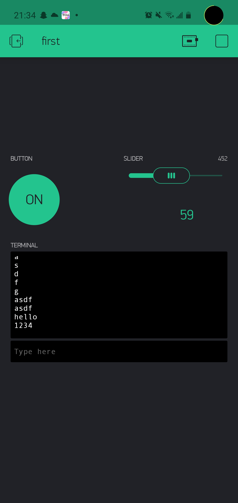

Name: Codey Sun

EID: lcs2672

Team Number: F13

## Questions

1. What is the purpose of an IP address?

    To allow machines to differentiate between other machines over the internet

2. What is a DNS? What are the benefits of using domain names instead of IP addresses?

    A symbolic name for an IP address. It is much easier to remember than a bunch of numbers

3. What is the difference between a static IP and a dynamic IP?

    Static IPs never change while dynamic IPs change over time

4. What is the tradeoff between UDP and TCP protocols?

    TCP allows guaranteed data delivery but is slower while UDP is faster but not reliable

5. Why can't we use the delay function with Blynk?

    No other process can be done while the delay function is active (blocking)

6. What does it mean for a function to be "Blocking"?

    Nothing else can be run while it is running

7. Why are interrupts useful for writing Non-Blocking code?

    It allows you to call a function only when needed without having to constantly check its parameters.

8. What is the difference between interface and implementation? Why is it important?

    Interface defines how a function is called while implementation describes what it does. This is important in knowing how to correctly use libraries.

9. Screenshot of your Blynk App:

    
